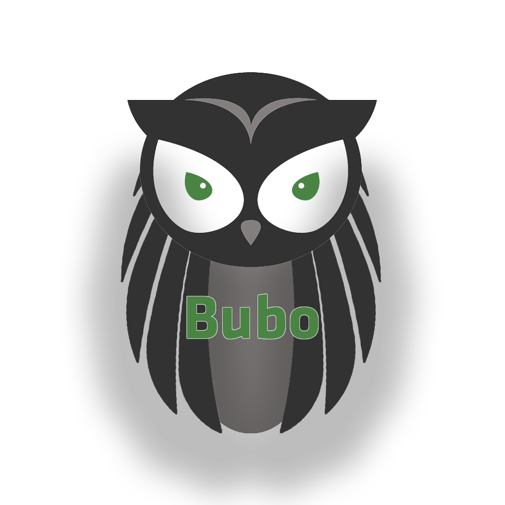
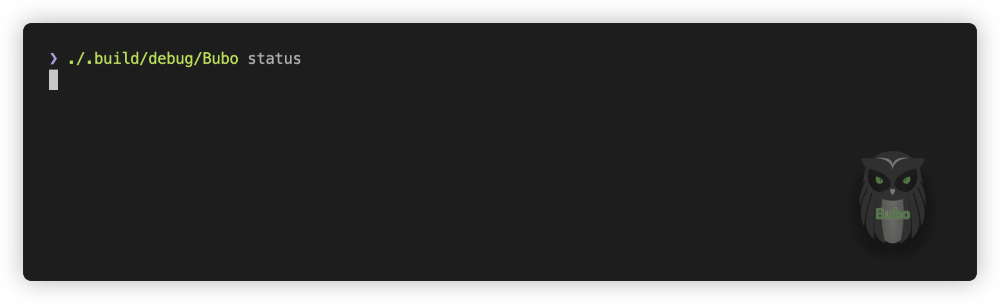
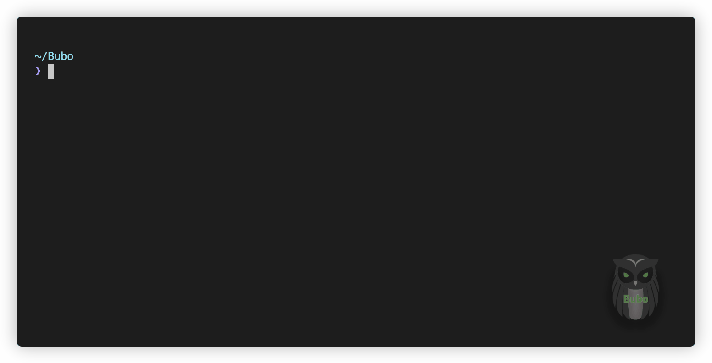

<p align="center" href="">
  
</p>
<p align="center">
	<a href="https://apodini.github.io/bubo/">
        
    </a>
    <a href="./LICENSE">
        
    </a>
    <a href="https://swift.org">
        
    </a>
</p>


# Bubo

Bubo is an opensource sourcecode analyser for [Swift](https://github.com/apple/swift). 

The tool has been developed to support developers in the endeavour of decomposing Swift server-side applications into microservices and provides an infrastructure to manage the decomposition process.

Bubo is still under development and is <span style="color: red">not</span> stable! Contributions are welcome, please check the contributions section if you want to help out.

## Requirements
Bubo has been developed for the use with macOS 10.15.5 and Swift 5.2.4 and higher. 

As Bubo makes use of the clang compiler, it is required to run on the specified Swift version. 

## Setup
Bubo can be build via the swift compiler:
1. Clone bubo to your prefered directory
```bash
git clone <url>
```
2. Move into the cloned repository
```bash
cd Bubo
```
3. Build Bubo via the command line
```bash
swift build
```

Due to a [linker error](https://forums.swift.org/t/swiftsyntax-with-swift-5-1/29051/12) with SwiftSyntax, building from Xcode does not work out of the box. 

To solve this issue, you can create an alias to the corresponding library as follows: 
```bash
ln -s $(xcode-select -p)/../Frameworks/lib_InternalSwiftSyntaxParser.dylib /usr/local/lib
```
## Usage
Bubo provides you with a comprehensive command line interface based on the [swift-argument-parser](https://github.com/apple/swift-argument-parser).

As Bubo is still in its prototyping phase, you can use the executable generated in the `.build/debug` directory. 

To check if Bubo has been set up correctly, type:
```bash
$> ./.build/debug/Bubo status
```
<p align="center" href="">
  
</p>

Bubo allows you to create projects and manage a set of services in a project. A service is any kind of Swift based program that forms an individual deployment unit in your system. 

For a full documentation on how to use Bubo, we refer you to Bubo's help pages: 
```bash
$> ./.build/debug/Bubo -h
```

<p align="center" href="">
  
</p>


## Technical Background

Bubo uses [SwiftSyntax](https://github.com/apple/swift-syntax) and the [IndexStoreDB](https://github.com/apple/swift-syntax), to generate structural dependency graphs for arbitrary Swift programs.

These dependency graphs are the basis for analysis operations and feature location. 

The structural analyser is still work in progress.
A semantic analyser and feature location component are planned. We will update this README, when we can provide you with more information on this. 

## Contributing
Contributions to this projects are welcome. Please make sure to read the [contribution guidelines](https://github.com/Apodini/.github/blob/release/CONTRIBUTING.md) first.

## License
This project is licensed under the MIT License. See [License](https://github.com/Apodini/Template-Repository/blob/release/LICENSE) for more information.
